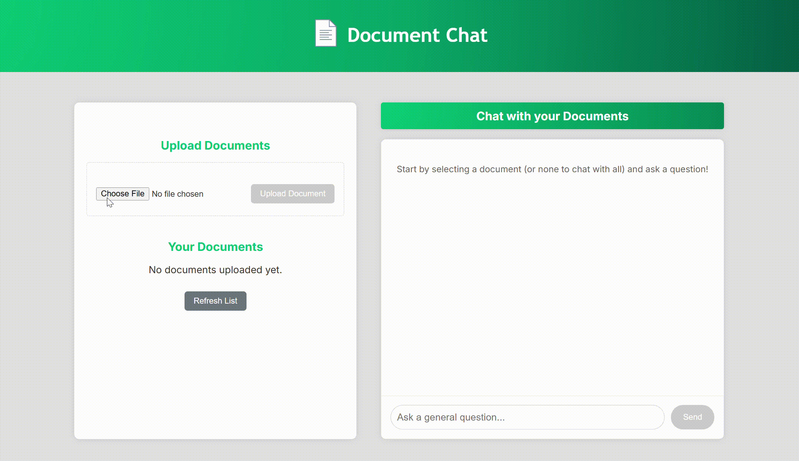

# RAG - Document Chat: Chat with TXTs and PDFs  

This project provides a Retrieval-Augmented Generation (RAG) powered personal knowledge assistant. It allows users to upload documents (PDF/TXT), which are then processed and stored in a local vector database. Users can then ask questions, and the assistant will provide contextual answers based on the uploaded content using a local Large Language Model (LLM).

### Features
- **Document Upload:** Upload PDF and TXT files.
- **Text Processing:** Documents are chunked and embedded.
- **Local Vector Database:** ChromaDB for efficient context retrieval.
- **Local LLM:** Ollama for text generation, ensuring privacy and no API costs.
- **Chat Interface:** Interact with your documents.
- **Document Management:** List and delete uploaded documents.
- **Smaller Screen Optimization:** Resizing is smooth for smaller screen such as mobiles.

<br><br>

## Quick Start - Setup

Follow these steps to get the project up and running on your local machine.

### Prerequisites
Before you begin, ensure you have the following installed:
- **Python 3.9+** and **pip**.
- **Node.js** & **npm**: (or **Yarn**) For the React frontend.
- **Ollama**: For running local Large Language Models.

### Backend Setup
After cloning the repository, navigate to the backend directory and:
- **Create and Activate Virtual Environment**: It's highly recommended to use a virtual environment to manage dependencies.

    ```
    python -m venv .venv

    # On Windows:
    .venv\Scripts\activate

    # On macOS/Linux:
    source .venv/bin/activate
    ```

- **Install Python Dependencies:**
  ```
  pip install -r requirements.txt
  ```

- **Set up Ollama Model**: Before running the backend, you need to start the Ollama server.
  - Open a **new terminal window** and run:
  
    ``` 
    ollama serve
    ```
  
  - Pull the `phi3` model, which will be used as your local LLM. In the terminal, type:
    ```
    ollama pull phi3
    ```

    This will download the model. 
    
    As for the `LOCAL_EMBEDDING_MODEL_NAME` (`all-MiniLM-L6-v2`) model, it will be downloaded automatically by the backend on its first use.

- **Run the Backend Server**: With your virtual environment active and Ollama running, start the FastAPI backend:
  ```
  uvicorn main:app
  ```

### Frontend Setup

After openning a **new terminal window** and navigating to the frontend directory:

- Install the required Node JS packages:
  
  ```
  npm install

  # Or if you use Yarn:
  # yarn install
  ```

- Run the Frontend Application:

  ```
  npm start
  
  # Or if you use Yarn:
  # yarn start
  ```

Your web browser should automatically open to your localhost, displaying the frontend application, with a working backend too.
<br><br>

## Usage
1.	**Upload Documents:** Use the "Upload Documents" section on the left to add your PDF or TXT files. The backend will process them in the background.
2.	**Chat:** Once documents are processed (you can refresh the document list), you can select a specific document to chat with by clicking on it in the Documents tab. Type your question in the chat input and press "Send." The assistant will retrieve relevant context and generate an answer.

> **NOTE:** You can use the samples given in the `testing_samples` folder located in the root folder, in order to test the tool on and chat with. 



<br><br>

## Project Structure - Backend
```
backend/
├── app/                       # Main application source code
│   ├── api/                   # API endpoints definition
│   │   └── endpoints.py       # FastAPI routes
│   ├── config/                # Configuration settings
│   │   ├── config.py          # Application settings (paths, model names, etc.)
│   │   └── logging.py         # Logging configuration
│   ├── db/                    # Database interaction layer
│   │   └── chromadb_manage.py # ChromaDB client, collection management, add/query/delete
│   ├── models/                # Data models and schemas
│   │   └── schemas.py         # Pydantic models for request/response validation
│   └── services/              # Business logic and external integrations
│       ├── document_processing.py # Text extraction, chunking, embedding generation
│       └── rag_services.py    # RAG orchestration, LLM calls (Ollama)
├── chroma_data/               # Persistent storage for ChromaDB
│   └── chroma.sqlite3         # ChromaDB's SQLite database file, created after running
├── tests/                     # Unit and integration tests (currently empty)
├── uploaded_documents/        # Directory for temporarily storing uploaded files, created after running
├── app.log                    # Application log file
├── main.py                    # FastAPI application entry point
└── requirements.txt           # Python dependencies (generated by pip freeze so I might've added some unnecessary ones)
```

### Here is a small overview of the backend architecture:

`app/`: This is the core of your application's source code. It's further divided into logical sub-modules:

- `api/`: Contains `endpoints.py`, which defines all the HTTP routes (API endpoints) that your frontend or other clients will interact with. This is the "interface" to your backend.

- `config/`: Holds configuration-related files, defines application-wide settings (like file paths, model names, API URLs), often loaded from environment variables, but here all is local and there is no external model API calls so no need for an env file. It also has the setupfor the application logs messages.

- `db/`: Manages direct interactions with the local Chroma database, specifically handles all operations related to ChromaDB, such as creating collections, adding documents, querying for relevant information, and deleting data.

- `models/`: Contains `schemas.py`, which defines Pydantic models. These are used for data validation (ensuring incoming requests have the correct format) and for defining the structure of responses sent back to the client, increasing scalabality and cleaner for the code overall.

- `services/`: Implements the core business logic; **document processing** and **rag implementation**.

    - `document_processing.py`: Handles tasks for extracting text from PDFs (by Py2PDF) / TXTs, splitting text into manageable chunks, and generating numerical embeddings for these chunks using **SentenceTransformer**, specifically using the `all-MiniLM-L6-v2` model.

    - `rag_services.py`: Orchestrates the Retrieval Augmented Generation (RAG) process. It takes a user query, retrieves relevant information from the vector database (via db/chromadb_manage.py), constructs a prompt, and sends it to your local LLM (Ollama), specifically `phi3`, to generate a response.

- `chroma_data/`: This directory is where ChromaDB stores its persistent data. When you use chromadb.PersistentClient, all the vector embeddings, document chunks, and metadata are saved here. Created after running the code.

- `tests`: A place for the unit tests.

- `uploaded_documents/`: A temporary storage location for the raw PDF/TXT files uploaded by the user before they are processed and their content is stored in ChromaDB. Created after running the code.

- `app.log`: This is the log file where the application will write its operational messages, errors, and debugging information, as configured in app/config/logging.py.

- `main.py`: The entry point for the FastAPI application. When you run `uvicorn main:app`, this file is executed, setting up your FastAPI app and all its endpoints.

- `requirements.txt`: Lists all the Python libraries and their versions that are needed to run.

This structure provides a clear separation of concerns, making the project easier to understand, develop, debug, and expand in the future, as well as abiding to the best security practices.

<br><br><br>

## Project Structure - Frontend

```
frontend/
├── public/                  # Publicly accessible assets
│   ├── assets/              # Static assets
│   │   └── logo.png         # Project logo or other images
│   └── index.html           # Main HTML file (React app entry point)
├── src/                     # Source code for the React application
│   ├── components/          # Reusable UI components
│   │   ├── ChatInterface.tsx  # Component for the chat UI and logic
│   │   ├── DocumentList.tsx # Component to display and manage uploaded documents
│   │   └── FileUpload.tsx   # Component for file upload functionality
│   ├── services/            # API communication and external service integrations
│   │   └── api.ts           # Centralized Axios/Fetch calls to backend API
│   ├── App.css              # Global application styles, all in one since the app is small
│   ├── App.test.tsx         # Jest test file for the main App component - not used
│   ├── App.tsx              # Main React application component
│   ├── index.css            # Global CSS styles
│   ├── index.tsx            # Entry point for the React application (ReactDOM.render)
│   ├── setupTests.ts        # Setup file for Jest testing environment - not used
│   └── types.ts             # TypeScript type definitions for data structures
├── package-lock.json        # Records the exact versions of dependencies
├── package.json             # Project metadata and script commands
└── tsconfig.json            # TypeScript configuration file
```

### Explanation of the Frontend Structure:

This structure is typical for a React application created with Create React App and organized for a clear separation of concerns:

* **`public/`**: This folder holds static assets that are served directly by the web server without being processed by Webpack.

    * **`assets/`**: A sub-directory for static assets like images (`logo.png`).

    * **`index.html`**: The main HTML file.

* **`src/`** where all the React app's source code is.

    * **`components/`**: Contains individual, reusable React components that make up the UI.

        * `ChatInterface.tsx`: Handles the display of chat messages, user input, and interaction with the chat API.

        * `DocumentList.tsx`: Displays the list of uploaded documents and provides options like selection or deletion.

        * `FileUpload.tsx`: Manages the UI and logic for uploading files to the backend.

    * **`services/`**: This directory is for code that interacts with external services.

        * `api.ts`: Centralizes all the API calls (using Axios or Fetch) to the backend, making them reusable and easier to manage.

    * **`App.css`**: Universal CSS for the components (the app was too small to separate the CSS among components).

    * **`App.tsx`**: The main application component.

    * **`index.tsx`**: The entry point of your React application.

    * **`types.ts`**: A dedicated file for defining TypeScript interfaces and types. This helps ensure type safety and improves code readability and maintainability across the application.

* **`package-lock.json`**: Holds exact project dependency versions.

* **`package.json`**: Defines the project's metadata.

* **`tsconfig.json`**: The configuration file for TypeScript, specifying compiler options and root files.

<br><br>

